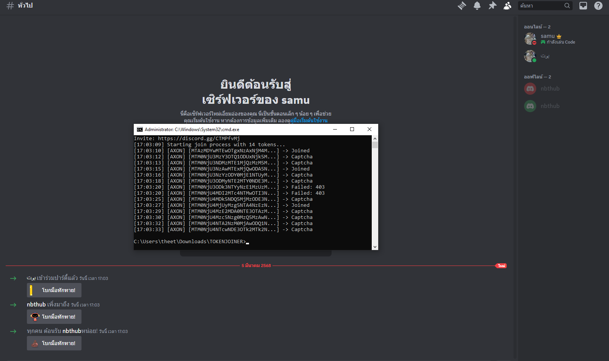

# Discord Token Joiner 🚀

<div align="center">
  
  
  
  
</div>

## 🌟 Features | คุณสมบัติ

- 🚄 **Fast Processing** - Join multiple tokens simultaneously
- ⚡ **Simple Setup** - Easy to use and configure
- 🎯 **Token Management** - Efficient token handling
- 📊 **Status Tracking** - Real-time join status monitoring

## 📥 Installation | การติดตั้ง

```bash
# Install requirements
pip install -r requirements.txt
```

## 🚀 Usage | วิธีใช้งาน

1. Add your tokens to `tokens.txt`:
```
MTM0NjU2NzE5NjAwMzkyNjAzN...
MTM0NjU2NzgyMDIwNDU3Mjc5M...
```

2. Run the script:
```bash
python main.py
```

3. Enter your Discord invite when prompted.

## 📝 Example Output | ตัวอย่างผลลัพธ์

```
[15:33:43] [AXON] [MTM0NjU2NzE5NjAwMzkyNjAzN...] -> Joined
[15:33:43] [AXON] [MTM0NjU2NzgyMDIwNDU3Mjc5M...] -> Captcha
[15:33:43] [AXON] [MTM0NjU2ODQ1NTIwNTQyNTIwO...] -> Joined
```

## ⚠️ Disclaimer | ข้อควรระวัง

This tool is for educational purposes only. Use at your own risk. The developer is not responsible for any misuse or damage. 